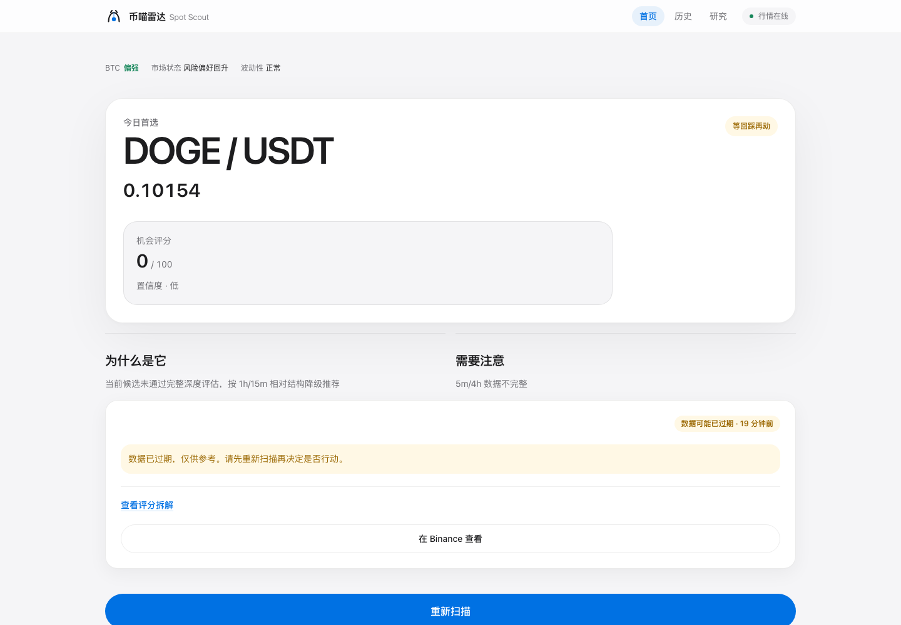
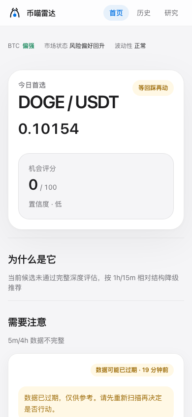

<p align="center">
  
</p>

<h1 align="center">币喵雷达 · Spot Scout</h1>

<p align="center">
  <strong>当前市场，我只替你挑一个。</strong>
</p>

<p align="center">
  <a href="#quick-start"></a>
  
  
</p>

<p align="center">
  <a href="https://deploy.workers.cloudflare.com/?url=https://github.com/279458179/binance-spot-scout">
    
  </a>
</p>

---

Spot Scout 是一个面向 Binance USDT 现货的 1 日内中短线扫描器。它不简单搬运 24 小时涨幅榜，而是用 Ranking-First 漏斗、跨市场相对强度、四周期结构、机会分与硬风险闸门，给出当前相对最优候选；系统性异常时才显示市场停扫。

## Interface

<p align="center">
  
</p>
<p align="center">
  
</p>

## Features

- **一次只给一个答案** — `BUY_NOW` / `BUY_ON_PULLBACK` / `WATCH_ONLY` / `MARKET_HALT` 四态决策。
- **Ranking-First 漏斗** — 全市场 → 流动性 Universe → 4h/1h/15m/5m → 风险与机会分 → Top1。
- **相对机会分** — 在同一轮市场里比较结构、位置、动量与软风险，可执行候选不会被高分但不可执行的标的挡住。
- **硬性风险闸门** — 系统性异常、数据缺陷与不可控风险优先淘汰；软风险只扣分或降级，不轻易清空候选。
- **研究结果页** — 按 7 天 / 30 天拆分各决策状态的样本量、命中率、MFE/MAE 与 24 小时表现。
- **闭环复盘** — 历史时间线展示入场、目标、失效、MFE/MAE、1h/6h/24h 价格与 +3%/+5% 结果。
- **真实行情** — 只读 Binance 公开现货接口（`exchangeInfo` / `24hr ticker` / `bookTicker` / `klines`），无需 API Key，不接账户权限。
- **分阶段漏斗** — 全市场 → USDT 现货 → 流动性过滤 → Top 100~120 → 15m+1h → Top 15 → 深度分析 → Top 1，避免对每个币都请求四套 K 线。
- **实时追踪** — 对选出的标的用 WebSocket 最优买卖价盯住距离 `+5%` 目标还有多远。
- **历史留痕** — 每次扫描（含 `MARKET_HALT`）都写进 D1，`/history` 可以看到这个算法到底准不准。
- **免费部署** — 一个 `wrangler.jsonc` 覆盖 Static Assets + Worker + KV + D1 + Cron，Fork 后几步就能跑起自己的实例。

## How it works

```
Binance 全市场
      ↓
Binance 全市场
      ↓
USDT 现货与基础过滤
      ↓
流动性 Universe
      ↓
相对强度初筛
      ↓
四周期分析（4h / 1h / 15m / 5m，只用收盘 K 线）
      ↓
硬风险闸门 + 机会分排名
      ↓
Top 1
      ↓
BUY_NOW / BUY_ON_PULLBACK / WATCH_ONLY / MARKET_HALT
```

## Strategy

### Decision Model

机会分以“可执行的相对机会”为核心：硬风险先淘汰，软风险扣分只扣一次；4h 宏观、1h 趋势、15m setup 与 5m trigger 都进入判断。`BUY_NOW` 要求 5m 触发确认且价格距 EMA21 不超过 1.2 ATR；结构好但位置偏高会降级为 `BUY_ON_PULLBACK`；暂无触发但仍可输出符号时为 `WATCH_ONLY`；只有系统性异常才输出 `MARKET_HALT`。

计划输出包含参考价、理想入场区、回踩参考、+3% / +5% 目标、失效位与风险回报比。`Why This Coin` 与 `Risk Insights` 展示入选理由和风险，`/debug` 保留 Top 候选与漏斗诊断。

## Quick start

```bash
npm install
npm run dev          # http://localhost:5173
```

无需任何环境变量即可本地运行 —— 默认直连 Binance 公开行情。

```bash
npm test             # 单元 / 集成用例
npm run test:e2e     # Playwright 决策流 + 375/390/430/768/1440 响应式
npm run typecheck
npm run lint
npm run build
```

## Local Development

| 命令 | 作用 |
| --- | --- |
| `npm run dev` | Vite + Cloudflare 插件，本地跑起 Worker 与前端 |
| `npm run build` | 类型检查 + 产出 `dist/client` 与 Worker bundle |
| `npm run backtest` | 从历史决策时刻重建全市场 Universe 并做 walk-forward 回测 |
| `npm run smoke-test` | 对真实接口跑一次最小链路自检 |

开发模式下 `/debug` 可访问，生产环境由 `ENABLE_DEBUG=false` 隐藏。

## Cloudflare Deployment

### 方式一：Deploy 按钮

点击顶部 **Deploy to Cloudflare**，Cloudflare 会引导你创建 KV 与 D1 资源并写入绑定。

### 方式二：手动

```bash
npx wrangler kv namespace create SCAN_CACHE
npx wrangler d1 create spot_scout_db
npx wrangler d1 migrations apply spot_scout_db --remote
```

把返回的两个 id 填进 `wrangler.jsonc`（`kv_namespaces[0].id`、`d1_databases[0].database_id`），然后：

```bash
npm run deploy
```

`wrangler.jsonc` 已包含 Static Assets、Worker、KV、D1、自定义域名 `binance.myg2ray.top` 与 2 分钟一次的 Cron。部署前请执行 `npx wrangler d1 migrations apply spot_scout_db --remote`，确保 v1.1 去重与 outcome 字段已应用。首次配置自定义域名时，域名所在 Zone 必须已托管在同一个 Cloudflare 账号。

## Data Integrity

同一个 symbol + 状态 + 15m 决策 K 线只写一个统计样本；数据库层使用唯一索引兜底。`POST /api/scan` 有内存 single-flight 和每 IP 限流，`GET /api/symbol/:symbol` 也有限流。首页扫描默认 30 秒冷却。

> **地域限制提示（重要）**：Binance 会按网段拒绝请求（HTTP 451 / 403），
> 官方公开镜像在部分数据中心出口上完全不可达。本项目内置
> `data-api.binance.vision` → `api.binance.com` → `api.binance.us` 的依次回退，
> 并把被拒的域名放进冷却名单以免拖慢扫描。
>
> 需要注意：回退到的 **US 场地流动性远低于全球主站**（其最深的 `BTCUSDT`
> 24h 成交额约 4–5M USDT），而策略的流动性下限是硬性的 **5M USDT**
> （见 [Strategy](#strategy) 与 `SCAN_CONFIG.minQuoteVolume24h`）。因此**部署在受限
> 网段时，扫描会如实返回 `MARKET_HALT`，并说明“没有标的达到成交额下限”** ——
> 这是风控在正常工作，而不是接口故障。本项目**不会**为了产出信号而自动放宽这个
> 下限：低流动性带来的滑点正是策略要规避的风险。
>
> 想让扫描真正筛出候选，请让 Worker 能访问全球主站（把 `BINANCE_BASE_URLS`
> 指向一个可用的镜像或自建代理）：
>
> ```bash
> npx wrangler secret put BINANCE_BASE_URLS   # 或写进 wrangler.jsonc 的 vars
> # 例：https://data-api.binance.vision,https://api.binance.com
> ```

## Configuration

| 变量 | 默认 | 说明 |
| --- | --- | --- |
| `ENABLE_DEBUG` | `false` | 生产环境是否暴露 `/debug` 与 `diagnostics` |
| `STRATEGY_VERSION` | `1.3.0` | 写入每次扫描结果与 D1，便于跨版本比较 |
| `BINANCE_BASE_URLS` | 见上 | 可选，逗号分隔的行情站点列表 |

`CLOUDFLARE_API_TOKEN` / `CLOUDFLARE_ACCOUNT_ID` 只用于 CLI 部署，不要提交到仓库（`.env.example` 仅有变量名）。

## Backtest

`npm run backtest` 从历史 15m 决策 K 线出发，先用当时已收盘的数据重建 24h 成交额排名和 `Top 120` Universe，再执行 `Top 120 → Top 30 → Top 1` 策略漏斗，并统计信号之后 1h / 6h / 24h 收益、最大涨幅、最大回撤与 `+3%` / `+5%` 命中。可运行 `npm run backtest -- --days=N`（1–30 天）。

> **当前限制**：Binance 不提供历史 `exchangeInfo`，回测使用当前可交易 USDT Universe 近似当时市场；缺少当时 K 线的标的会被自然排除。历史 spread 也无法还原，因此使用固定的 `0.1%` 近似。

## FAQ

**它会不会替我下单？**
不会。只读公开行情，不接入任何账户权限，也不存在买卖 / 提现 / 划转接口。

**为什么有时显示「市场停扫」？**
这只在系统性异常、数据不可用或 BTC 快速崩跌时出现；普通软风险只会降级为回踩或观望。

**`BUY_NOW` 是可以买的意思吗？**
不是。它表示「当前结构值得关注」，是研究结论而非投资建议，请自行判断并控制风险。

**可以换成别的交易所吗？**
V1 只做 Binance USDT 现货。行情站点可通过 `BINANCE_BASE_URLS` 指向镜像，但数据结构必须与 Binance 现货一致。

## Disclaimer

本项目仅为行情研究工具，不构成任何投资建议，不接入下单权限。加密资产波动极大，请自行承担风险。

## Roadmap

- V1.3（当前）：Apple White 界面重构、雷达品牌视觉、移动端与无障碍优化
- V1.1：四态决策、四周期与机会分、History/Research、D1 去重、single-flight、全市场 walk-forward backtest
- V2（规划）：可选的交易连接器，必须由 Feature Flag 显式开启，默认关闭

## License

[MIT](LICENSE)
